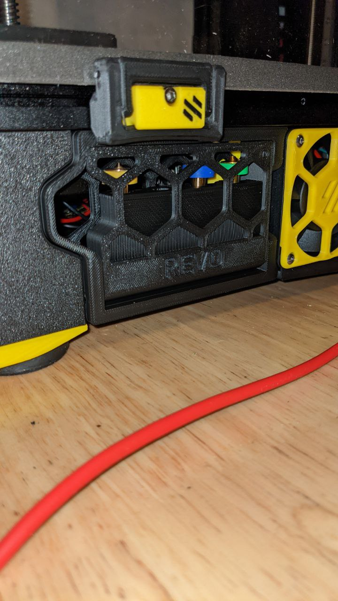
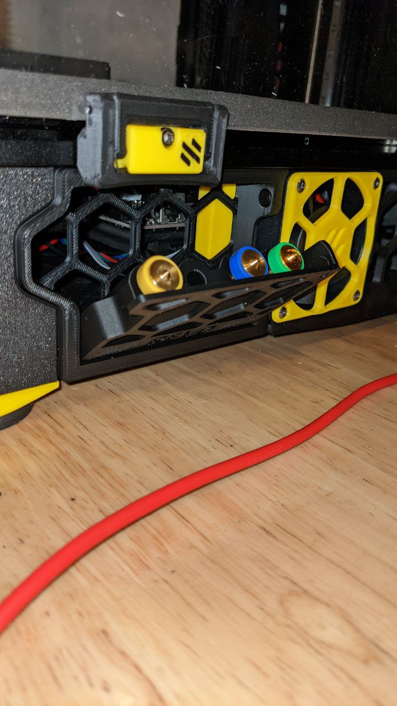

# Revo_Nozzle_Skirt

A revo nozzle box hidden in a skirt

# Bill Of Materials

- 2x 6mm x 3mm Round Magnet
- 2x M3 Heat-set insert
- 2x M3x8 BHCS

# Instructions

- print either the left or right versions of the parts depending on which side of the printer you're installing on. 
- install the 2 heat-set inserts into the ends of nozzle-holder part.
- install 1 magnet in the skirt, and one in the nozzle-holder such that they attract eachother when the door is installed.
- insert the door into the skirt part and fasten with 2 M3x8 BHCS
- Remove the stock skirt piece and install the new one in it's place.